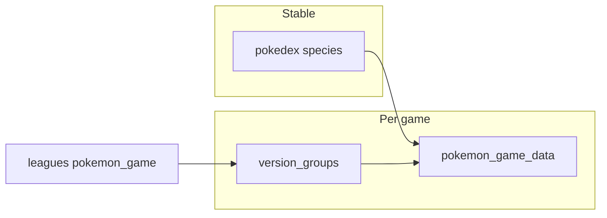

# Generation-scoped Pokemon data (Laravel 12 + Inertia + Vue)

## How your current code fits

- `[app/Modules/Pokedex/Models/Pokedex.php](app/Modules/Pokedex/Models/Pokedex.php)` and `[database/migrations/2025_01_01_000001_create_pokedex_table.php](database/migrations/2025_01_01_000001_create_pokedex_table.php)`: one row per species with `nationaldex_id`, types, sprite—good as the **stable key** (align this with PokeAPI’s species / national dex concept).
- `[app/Modules/Pokedex/Controllers/PokedexController.php](app/Modules/Pokedex/Controllers/PokedexController.php)` loads `Pokedex::all()`—will not scale once you add per-version payloads; move listing to a query + pagination.
- `[app/Modules/Pokedex/Actions/QueryPokedexAction.php](app/Modules/Pokedex/Actions/QueryPokedexAction.php)` already scopes by league for drafts; league-level **game/generation** will eventually align “what’s legal” with the same `version_group` you store for snapshots.

## Core modeling principle

**Two axes (both useful):**

| Axis                                  | Role                                                                                                                                                                                                                                                                             |
| ------------------------------------- | -------------------------------------------------------------------------------------------------------------------------------------------------------------------------------------------------------------------------------------------------------------------------------- |
| **Generation** (1–9, later 10+)       | Coarse UX: grouping, filters, copy (“Gen 9 league”). Easy to extend with new int values.                                                                                                                                                                                         |
| **Game / ruleset** (PHP `BackedEnum`) | **Source of truth** for data that changes: which moves, abilities, items, stats, and mechanics exist. Map each case to a PokeAPI `**version_group`** slug (e.g. `scarlet-violet`, `sword-shield`). Same generation can have multiple games; SV and SWSH are not interchangeable. |

Store on `[app/Modules/League/Models/League.php](app/Modules/League/Models/League.php)` (new migration): e.g. `pokemon_generation` (unsigned tinyInteger or smallInteger) + `pokemon_game` (string backed enum column). Validate enum cases against a single config/array so adding Gen 10 is “new enum case + new version_group row + import job”, not scattered magic strings.

**Version groups in DB** (small lookup table, not only an enum): `version_groups` with `id`, `slug` (PokeAPI key), `generation`, `sort_order` (for “latest” default). The enum on `leagues` should reference the same slug (or FK to `version_groups`) so imports and UI stay consistent.

## Data that changes by generation / game (keep complexity bounded)

Recommend a **hybrid** that stays performant without exploding into dozens of tables on day one:

1. **Dimension tables (mostly static identity)**
  - `moves` (pokeapi id or slug + name)  
  - `abilities`  
  - `items`  
   Shared across games; game-specific *availability* is either derived from learnsets / item endpoints at import time or stored as pivots later.
2. **One snapshot row per (pokedex_id, version_group_id)** — e.g. `pokemon_game_data`
  - Columns: stats (hp/atk/def/spa/spd/spe), types (if they can change by form/game—your current table may stay “default” and overrides live here), ability slots (names or FKs).  
  - **JSON column** for “heavy” lists: full learnset as `[{ "move_id": …, "method": … }]`*, mechanics flags (`tera`, `dynamax`, `gmax`, `z_move`, `mega`) as a small object or columns.  
  - **Why**: one indexed lookup serves the detail page; no N+1 across thousands of pivot rows.  
  - **When to normalize**: add `pokemon_game_moves` (pivot) only if you need relational queries like “all Pokémon that learn move X in SV” or Scout-style search across moves—defer until that feature is real.
3. **Moves / abilities / items “in the game”**
  - **Simplest**: at import, populate `game_moves`, `game_abilities`, `game_items` as `(version_group_id, foreign_id)` or store count-only and derive legality from snapshots—choose based on whether you need standalone Attackdex/Itemdex pages with their own filters.  
  - **Minimal path**: first ship Pokémon detail + league context; add separate dex tables when you build those UIs.

## Gen 9 data (ship in this effort)

**Target version group:** PokeAPI `scarlet-violet` (Gen 9). This is the only version group that must be **fully imported** before the feature is considered done for v1.

**Minimum import payload per species** (for each `pokedex` row, map national dex / species id → PokeAPI `pokemon` + `pokemon-species` as needed):

- Base stats for SV (or default form used in your app).
- Types and ability slots as they apply in SV.
- Full learnset for `scarlet-violet` in the JSON structure you choose (level / TM / egg / tutor, etc.).
- **Generational mechanics for Gen 9:** at least **Tera** availability/type patterns you care to show; Megas/Z-Moves/Dynamax can be stored as absent/false for SV for clarity in the UI toggle.

**Coverage:** Import for **every species currently in `pokedex`** (skip or log rows with no SV data / unreleased edge cases). **Rate limiting:** queue workers + chunked jobs (e.g. per species or batches), retries, and a documented one-off `php artisan …` command to (re)run the SV import after deploy.

**League / UI defaults:** New leagues default to **generation 9** and **Scarlet/Violet** enum until you add more games. Pokedex detail default version = `scarlet-violet` (highest `sort_order` until Gen 10 exists).

## PokeAPI usage (best practice here)

- **Never** call PokeAPI from request cycle for league or Pokedex pages (latency, rate limits, outages).  
- Use **Artisan commands + queued jobs** (chunked, idempotent `updateOrCreate` on `version_group` + `pokemon_game_data`). Optionally `Http::retry()` and respect `config/services.php` base URL.  
- Store **PokeAPI numeric IDs** on dimension rows where helpful; keep `**version_group` slug** as the join key to their API.  
- After import, **cache** hot reads: `Cache::remember("pokemon:{$id}:{$slug}", …)` for detail payloads if JSON is large.

## League UI and validation

- Extend `[app/Modules/League/Actions/CreateEditLeagueAction.php](app/Modules/League/Actions/CreateEditLeagueAction.php)` (and the create/edit Inertia form) with `pokemon_generation` + `pokemon_game`; validate `pokemon_game` is a known `BackedEnum` case and optionally that its `generation` matches `pokemon_generation` (or derive generation from enum and drop redundant field—your call; two fields match your spec explicitly).

## Pokedex UI

**Index** (`[resources/js/pages/pokedex/PokedexIndex.vue](resources/js/pages/pokedex/PokedexIndex.vue)`)  

- Replace `Pokedex::all()` with paginated query + **query-string filters**: `search` (name), `type1`/`type2`, optional `generation` (join or denormalize `generation` on `pokedex` from latest appearance if you want filter without a version pick).  
- Optional: Laravel Scout later on `name`—not required for v1 if `whereLike` + indexes suffice at your data size.

**Detail (new)**  

- Route e.g. `GET /pokedex/{pokedex}` → `PokedexController@show`.  
- Default `version_group`: highest `sort_order` row (or config `config/pokemon.php` default slug).  
- **Gen / game toggle**: `?game=scarlet-violet` or Inertia `router.get` with `preserveState`; load **only** the selected snapshot (and optionally use Inertia v2 **deferred props** for the heavy JSON block so first paint stays fast).  
- Card click: wrap `[PokemonCard.vue](resources/js/components/pokemon/PokemonCard.vue)` with `<Link :href="route('pokedex.show', id)">` (add `id` to the index payload).

## Performance checklist

- Indexes: `(version_group_id, pokedex_id)` unique on `pokemon_game_data`; indexes on `pokedex.name` for search; FKs on pivots if added.  
- Avoid loading full learnsets on the index—only on show (or deferred).  
- Eager load nothing on index beyond list columns.

## Testing (per project rules)

- Feature tests: league create/update persists `pokemon_game` + generation; Pokedex show returns 404 for unknown id; show uses default version when query missing; version query switches payload (mock or minimal fixture rows).  
- Include at least one test that assumes a `pokemon_game_data` row for `scarlet-violet` (factory or migration seed in test DB) so Gen 9 detail payload is covered without calling PokeAPI in CI.  
- Run targeted `php artisan test` filters after implementation.

## Suggested implementation order

1. Migration: `version_groups` + league columns + `pokemon_game_data` (with JSON for learnset/mechanics v1).
2. PHP `BackedEnum` for games + config map enum → PokeAPI slug (**ScarletViolet** + `scarlet-violet` row with `generation = 9`, highest `sort_order`).
3. **Gen 9 import:** run the full import for `scarlet-violet` until all `pokedex` species have `pokemon_game_data` rows (prove pipeline + production dataset).
4. Pokedex show + index pagination/filters + Vue toggle (other gens can appear in the toggle later with empty state until imported).
5. Wire league “primary game” into draft/legal checks only when you’re ready (separate from browsing).

