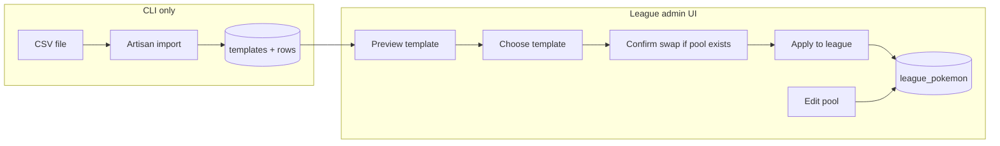

# League Pokémon: templates + admin UI (revised)

## Current state (baseline)

- **Live pool** is `league_pokemon`: `league_id`, `pokedex_id`, denormalized `name`, `cost`, `is_drafted`, `drafted_by`, `banned`, etc.
- **Web import**: `CreateEditLeaguePokemonAction` reads CSV (`nationaldex_id`, `cost`); `ImportLeaguePokemon.vue` in `AdminPanel`. **`LeaguePokemonController::create` lacks `authorize('admin', $league)`** — fix as part of this work.
- **Bulk migration**: `LeagueDraftCsvImportService` + `league:import-draft-csv` stays separate.
- **Pokedex**: `PokedexController::index` query can be reused/extracted for add-Pokémon search.
- **Authorization**: `LeaguePolicy::admin` = league owner or `admin_flag` team member.

## Target architecture

### 1. New persistence: templates

- **`league_pokemon_templates`**: `id`, `name` (display name), optional `slug` / `description`, `timestamps`.
- **`league_pokemon_template_rows`**: `id`, `template_id`, `pokedex_id`, `cost`, unique `(template_id, pokedex_id)`.

### 2. CLI: templates from CSV

Artisan command: path, display name, optional `--replace` by slug/name; CSV `nationaldex_id,cost`; resolve to `pokedex_id`.

### 3. Template preview (league admins)

**Goal:** Admins can inspect a template **before** committing.

- **Read-only route** (examples): `GET /leagues/{league}/admin/pokemon-templates` (list: id, name, slug, row_count) and `GET /leagues/{league}/admin/pokemon-templates/{template}` (detail for preview: paginated rows joined to `pokedex` for `name`, `sprite_url`, types, `cost`).
- **Authorization:** `$this->authorize('admin', $league)` on both; templates are global, league is only used for the gate (consistent with other admin URLs).
- **UI:** On the manager page, each template has **Preview** → drawer/modal/side panel showing summary (name, total species count, maybe total “points” sum optional) and a **paginated or virtualized table** (same card/grid patterns as elsewhere) so large templates stay performant.

### 4. Apply / swap template (with confirmation)

**First-time apply (empty pool):** No destructive warning; transactional insert from template rows into `league_pokemon` (set `name` from pokedex).

**Swap (pool already has rows):**

1. **UI:** If the league already has any `league_pokemon` rows, do **not** apply immediately. Show a **warning modal** explaining that continuing **will delete all existing league Pokémon for this league** and replace them with the selected template, and that this is irreversible from a pool perspective.
2. **Explicit confirmation:** Require a deliberate confirm (e.g. checkbox “I understand existing pool entries will be deleted” **and** primary button enabled only when checked, or a short typed phrase — pick one pattern and use it consistently). Single accidental click must not wipe the pool.
3. **Backend:** `POST` (or `PUT`) with e.g. `template_id` + `confirm_replace: true` (boolean). If pool is non-empty and `confirm_replace` is missing/false → **422** with message that confirmation is required.
4. **Safety gate (server-side, non-negotiable):** Before deleting any `league_pokemon`, verify **no row** is drafted (`is_drafted` / `drafted_by`) and **no** dependent records exist (`draft_picks`, `trade_pokemon`, `set_team_pokepaste_slots` referencing those ids, etc.). If **unsafe**, return **422** with a clear error (“Cannot swap template while Pokémon are drafted or in use”) — **do not** show the confirm flow as success path; optionally disable “Swap” in UI when league is in that state (derive flag from backend).

**Transaction:** Delete eligible `league_pokemon` for `league_id`, then bulk insert from template (or single transaction with delete+insert).

### 5. League admin: manage live pool

Same as prior plan: list, update cost, delete (when safe), add from pokedex search, mass CSV; upsert/unique `(league_id, pokedex_id)` recommended.

### 6. Hardening

- Authorization on all mutations; Form Requests.
- Fix redirect after import to manager / pokemon page.
- Optional DB unique on `(league_id, pokedex_id)` after data cleanup.

### 7. Tests (Pest)

- Preview endpoints: 403 non-admin; 200 with expected shape; pagination.
- Apply empty pool: rows created.
- Swap without `confirm_replace`: 422.
- Swap with confirm but drafted pokemon: 422, no deletes.
- Swap with confirm and clean pool: old rows gone, new rows match template.

## Files likely touched

- New: template migrations/models; Artisan command; preview + apply controller methods or dedicated controller; Vue manager + preview modal/drawer + confirmation modal.
- Update: `routes/web.php`; `LeaguePokemonController` or split; reuse Pokedex query for search.

## Out of scope

- Public template marketplace; template versioning (unless added later).
