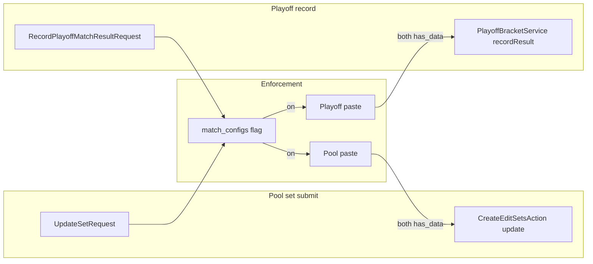

# Template catalog, usage stats (stored + visible), and enforce Pokepaste

## Decisions locked in

- **Template catalog**: Authenticated + verified only (same as `/pokedex`).
- **Cost suggestions**: **Out of scope** for this iteration (no suggest-costs CLI or formula work).
- **Usage stats**: **Persist** aggregates in the database and expose a **visible** stats area with **graphs**; primary metrics are **global across all leagues**: pick rate, ban rate, how often a species is **brought to a match** (from paste rosters), and **per-game** win / loss rate (derived from set scores + rosters). Optional UI filters (e.g. generation / version group) can be a follow-up unless specified later.
- **Pokepaste enforcement**: League-level toggle so **both** teams must have submitted usable roster paste data **before** pool **set** results (`CreateEditSetsAction` `command === 'update'`) and **playoff** results ([`PlayoffBracketService::recordResult`](app/Modules/Playoffs/Services/PlayoffBracketService.php)) where applicable.
- **Playoff Pokepaste**: Coaches can create/edit the same style of team paste for [`PlayoffMatch`](app/Modules/Playoffs/Models/PlayoffMatch.php) rows—including **potential** future cells so they can plan ahead—and those rosters feed the **same global bring / game W–L stats** as pool matches once the playoff match is **completed** (scores + winner recorded).
- **Playoff paste privacy**: Until a [`PlayoffMatch`](app/Modules/Playoffs/Models/PlayoffMatch.php) is **over** ([`isComplete()`](app/Modules/Playoffs/Models/PlayoffMatch.php)), **full paste payload** (slots, parsed data, Showdown text) is visible only to users who **belong to that paste’s `team_id`** (same authorization as editing). **Everyone else**—opponents, other league members, guests, and **league admins**—must **not** receive roster details in Inertia props, JSON, or paste routes. After the match is complete, relax read access (e.g. both teams + league participants mirroring pool match transparency—exact audience can match [`MatchDetail`](resources/js/pages/match/MatchDetail.vue) norms). **Enforcement UX** when the league requires paste before results: admins may need a **non-roster** signal (e.g. boolean “side ready”) without exposing species; define in implementation so opponents still never see opponent roster pre-match.

---

## A. Template catalog (unchanged intent from prior plan)

- **`is_published`** on `league_pokemon_templates` (default `true`); catalog lists **published** only; league admin can still list/apply **all** (or show unpublished—implementation detail).
- Routes: `GET /pool-templates` (Inertia), `GET /pool-templates/{template}/preview` (JSON, published only).
- Controller + Vue: group by **`VersionGroup.generation`**, then by **version group name** when multiple groups share a generation.
- Tests: guest redirect; auth OK; unpublished preview 404.

---

## B. Usage stats — store and display (no cost math)

### Scope

- **Denominators and numerators are global**: every league contributes to the same site-wide aggregates (no per-league breakdown required for v1).
- **Games** are inferred from **per-match scores** (no per-game rows):
  - **Pool**: [`Set`](app/Modules/Matches/Models/Set.php) with `team1_score` / `team2_score` when `status === 0` (completed).
  - **Playoffs**: [`PlayoffMatch`](app/Modules/Playoffs/Models/PlayoffMatch.php) with `team1_score` / `team2_score` when the match is **complete** (`winner_team_id` and `completed_at` set, per [`PlayoffMatch::isComplete()`](app/Modules/Playoffs/Models/PlayoffMatch.php)).
- **Rosters** for attribution come from the same **slot** model keyed off the appropriate **team paste parent** (today only pool: [`SetTeamPokepaste`](app/Modules/Pokepaste/Models/SetTeamPokepaste.php); after work: pool **or** playoff—see **section D**).

### Metrics (definitions)

1. **Pick rate (all leagues)**  
   - **Numerator**: count of [`draft_picks`](database/migrations/2025_01_01_000009_create_draft_picks_table.php) rows whose `league_pokemon` resolves to this `pokedex_id`.  
   - **Denominator**: total draft picks (all leagues).  
   - **Display**: `pick_count / total_picks` (and raw counts in tables).

2. **Ban rate (all leagues)**  
   - **Numerator**: count of [`draft_bans`](app/Modules/Draft/Models/Bans.php) rows for this `pokedex_id`.  
   - **Denominator**: total bans (all leagues).  
   - **Display**: `ban_count / total_bans`.

3. **Brought to a match (frequency / rate)**  
   - **Population**: **completed pool sets** (`sets.status = 0`) **and** **completed playoff matches** (winner + scores recorded), optionally requiring non-null scores.  
   - **Numerator**: count of **distinct** `(match_context, team_id, pokedex_id)` where `match_context` is a stable id for the pool set or playoff row (e.g. `set_id` vs `playoff_match_id`) and that team’s **paste** for that context has slots with `league_pokemon_id` → `pokedex_id` (dedupe per team per match per species).  
   - **Denominator (for a “rate”)**: same convention as before but **union** pool + playoff “team-match appearances” in the global denominator so playoff usage is comparable.

4. **Game win rate and game loss rate (all leagues)**  
   - **Pool**: For each completed `Set`, for each distinct `pokedex_id` on team1’s paste: add `team1_score` wins / `team2_score` losses; mirror for team2 ([`CreateEditSetsAction`](app/Modules/Matches/Actions/CreateEditSetsAction.php) semantics).  
   - **Playoffs**: Same attribution using [`PlayoffMatch`](app/Modules/Playoffs/Models/PlayoffMatch.php) `team1_score` / `team2_score` and each side’s playoff paste roster for that `playoff_match_id`.  
   - **Missing paste**: exclude that side (or entire match if either side missing—pick one rule and apply consistently) from bring / W–L so stats stay honest.  
   - **Display**: `game_wins / (game_wins + game_losses)` plus raw counts; loss rate explicit or complement.

### Storage shape (recommended)

**Option 1 — rolling “current” aggregate** (simplest for first graphs):

- One row per **`pokedex_id`** (global): `draft_pick_count`, `draft_ban_count`, `match_bring_count` (or named per convention above), `game_wins`, `game_losses`, `updated_at`.  
- Store **global denominators** once per rebuild (config row, cache, or single-row `usage_stats_meta`: `total_picks`, `total_bans`, `total_bring_units`, `rebuilt_at`) so the UI can compute rates without rescanning.

**Option 2 — snapshots** (time-series later): parent `usage_stat_snapshots` + child rows per `pokedex_id` + same columns + snapshot-level meta for denominators.

**Plan default**: **Option 1** first; note Option 2 for historical trend charts.

### Rebuild mechanism

- Artisan command e.g. `usage-stats:rebuild` (truncate aggregates + meta, then fill from SQL). Optional `schedule()` in [`routes/console.php`](routes/console.php).  
- Service class: batch queries / joins (no N+1).

### Visible UI

- Authenticated route e.g. `GET /usage-stats`: sortable table and **multiple charts** aligned to the four metric families (pick share, ban share, bring frequency, game win %).  
- Props: per-row counts + precomputed rates for chart series (labels + values).  
- Chart library: align with project dependency policy (small Vue chart lib or hand-rolled bars).

### Tests

- Seed leagues with picks, bans, completed **pool** sets + completed **playoff** rows, both paste types + slots; run rebuild; assert pick/ban/bring/game aggregates; feature test page includes rate fields.

---

## C. Enforce roster paste before recording results (pool + playoffs)

### Behavior

- **Pool**: When enabled, **`CreateEditSetsAction`** rejects `command == 'update'` unless **both** teams have paste + `has_data` for that `set_id` (same as today’s [`ReadMatchPokepasteSideSummariesAction`](app/Modules/Pokepaste/Actions/ReadMatchPokepasteSideSummariesAction.php) definition).
- **Playoffs**: When enabled, [`PlayoffBracketService::recordResult`](app/Modules/Playoffs/Services/PlayoffBracketService.php) / [`RecordPlayoffMatchResultRequest`](app/Http/Requests/Playoff/RecordPlayoffMatchResultRequest.php) must **fail validation** unless **both** `team1_id` and `team2_id` have playoff paste + `has_data` for that `playoff_match_id` **before** scores are saved.
- **Definition of “submitted”** for v1: `pasteSlots()->whereNotNull('league_pokemon_id')->exists()` (`has_data`). Centralize in a small helper used by pool summaries, playoff UI, validators, and stats exclusion rules. Optionally later require **all six** slots filled in one place.

### Persistence

- Add boolean on [`match_configs`](app/Modules/Matches/Models/MatchConfig.php), e.g. `require_set_team_pokepaste_before_results` (default `false`), via migration + `$fillable` + cast.

### Admin UX

- Toggle on existing league match config admin UI (e.g. [`MatchConfig.vue`](resources/js/pages/league/admin/MatchConfig.vue) or related form), **league admin** only (`LeaguePolicy::admin`).

### Coach UX

- **Pool coach UX**: [`MatchDetail.vue`](resources/js/pages/match/MatchDetail.vue): if enforcement is on and the current set is incomplete for either side, **disable** result submission and show **which side** is missing paste.
- **Playoff admin UX**: [`LeagueDetailPlayoffs.vue`](resources/js/pages/league/LeagueDetailPlayoffs.vue) / admin [`Playoffs.vue`](resources/js/pages/league/admin/Playoffs.vue): disable or warn on **record result** when enforcement is on and either side lacks paste.
- **Server-side validation**: [`UpdateSetRequest`](app/Http/Requests/Match/UpdateSetRequest.php) + playoff request/service gate (never rely on UI only).

### Tests

- Pool: flag on, submit without paste → error; with both `has_data` → success.
- Playoffs: flag on, `recordResult` without paste → error; with both → success.

---

## D. Playoff and planned-match Pokepaste

### Problem

- Pokepaste today is keyed only to **pool** [`Set`](app/Modules/Matches/Models/Set.php) via [`SetTeamPokepaste`](app/Modules/Pokepaste/Models/SetTeamPokepaste.php). **Playoffs** use separate [`PlayoffMatch`](app/Modules/Playoffs/Models/PlayoffMatch.php) rows ([`PlayoffBracketService`](app/Modules/Playoffs/Services/PlayoffBracketService.php)); there is no `set_id`.

### Data model (implementation choice)

- **Preferred**: One abstraction for “team roster for a match context” — e.g. **polymorphic** parent `team_match_pokepastes` with `matchable_type` ∈ {`Set`, `PlayoffMatch`}, `matchable_id`, `team_id`, unique `(matchable_type, matchable_id, team_id)`, reusing or migrating existing [`set_team_pokepaste_slots`](database/migrations/2026_03_23_180724_create_set_team_pokepaste_slots_table.php) to point at that parent (rename columns/table as needed).  
- **Alternative**: Parallel `playoff_match_team_pokepastes` + duplicate slot table — faster to spike but duplicates [`PokepasteController`](app/Modules/Pokepaste/Controllers/PokepasteController.php) / [`UpdateSetTeamPokepasteAction`](app/Modules/Pokepaste/Actions/UpdateSetTeamPokepasteAction.php) logic; avoid unless time-boxed.

### Authorization — “potential” matches (plan ahead)

- Coaches must be able to save a roster **before** they appear on the bracket cell (e.g. next round if they win).
- **Recommended rule (B)**: Allow `(PlayoffMatch, team_id)` when the user coaches `team_id`, the team is a **participant in that playoff**, and a small **bracket reachability** check says the team could still **legitimately** play in that slot (not eliminated; slot lies on a possible path—include bronze only if team can still reach bronze).
- **MVP fallback (A)**: Only when `team_id === team1_id || team_id === team2_id` on that row (no early planning for TBD cells — document if you ship A first).
- **Reject (C)**: “Any team can edit any cell” — do not use (unfair / confusing).

### Privacy / visibility (pre-match vs complete)

- **While match incomplete**: `authorize('view', …)` (or equivalent) for paste **read** and **update** = **only** users tied to that `team_id` (e.g. `Team` → `user_id` coach). **403** on [`PokepasteController`](app/Modules/Pokepaste/Controllers/PokepasteController.php) show/update/parse routes when the authenticated user is not that team’s coach. **Do not** embed opponent slot data or Showdown text in shared [`LeagueDetailPlayoffs`](resources/js/pages/league/LeagueDetailPlayoffs.vue) / [`Playoffs.vue`](resources/js/pages/league/admin/Playoffs.vue) props.
- **Bracket payload**: For incomplete matches, either omit per-side paste entirely for other viewers, or expose only **your** side’s data when building Inertia props (server-side branch on `Auth::id()` vs team coaches). Never leak the other team’s roster through shared JSON.
- **After match complete**: Widen **read** access to match pool norms (document parity with [`SetController`](app/Modules/Matches/Controllers/SetController.php) / match detail—both sides may view each other’s completed-match paste if that matches product for pool).
- **Global stats**: Aggregates in section B use **completed** matches only; no user-facing exposure of pre-match playoff rosters through the stats page beyond rolled-up counts.

### UI / routes

- **Member-facing**: [`LeagueDetailPlayoffs`](resources/js/pages/league/LeagueDetailPlayoffs.vue) (and admin bracket if coaches use it): per match cell, links or inline affordance to **edit paste** for **your** team when policy allows; **no** opponent roster preview pre-match.
- **Reuse**: Same paste editor flow as pool ([`PokepasteController`](app/Modules/Pokepaste/Controllers/PokepasteController.php), parse Showdown, slot grid) parameterized by `public_id` or new route model binding for the polymorphic record; **policy** gates every read/write.
- **Summaries for enforcement**: If the bracket must show “ready to record result”, expose **scoped** props (e.g. current user’s team only, or admin-only boolean flags without species) — design so **privacy rules above stay satisfied**.

### Stats linkage

- **Section B** rebuild: add SQL (or Eloquent chunks) that joins **completed** `playoff_matches` to the **playoff** paste parent + slots, **merging** into the same global per-`pokedex_id` bring and game W–L columns as pool data.

### Tests

- Policy: coach can save planning paste for allowed future slot; cannot save for arbitrary opponent-only cell under rule B.
- **Privacy**: before match complete, opponent / other user / **league admin** `GET` paste payload → **403** or empty per policy; owning coach → **200**. After complete, widen read per chosen rule.
- Stats: one completed playoff match with pastes produces expected bring + W–L contribution.

---

## E. Explicitly deferred

- **Automatic cost formulas** and any **CSV suggest-cost** CLI.
- **Apply template from catalog** one-click (can be a follow-up).

---

## File touch list (indicative)

| Area | Files |
|------|--------|
| Templates | Migration `is_published`, [`LeaguePokemonTemplate`](app/Modules/League/Models/LeaguePokemonTemplate.php), import commands, new catalog controller + Vue |
| Usage | Migration(s) for global per-`pokedex_id` stats + meta; aggregator merging **pool + playoff** completed matches; rebuild command; stats controller + Vue + charts; optional `routes/console.php` schedule |
| Playoff paste | Migrations (morph or parallel model), [`PlayoffMatch`](app/Modules/Playoffs/Models/PlayoffMatch.php) relations, bracket reachability helper (if rule B), **policies** (view/update by team + complete-match read), [`PokepasteController`](app/Modules/Pokepaste/Controllers/PokepasteController.php) / actions / requests, scoped Inertia props, [`LeagueDetailPlayoffs.vue`](resources/js/pages/league/LeagueDetailPlayoffs.vue), admin [`Playoffs.vue`](resources/js/pages/league/admin/Playoffs.vue), Pest |
| Pokepaste gate | Migration on `match_configs`, [`MatchConfig`](app/Modules/Matches/Models/MatchConfig.php), [`UpdateSetRequest`](app/Http/Requests/Match/UpdateSetRequest.php), [`CreateEditSetsAction`](app/Modules/Matches/Actions/CreateEditSetsAction.php), [`RecordPlayoffMatchResultRequest`](app/Http/Requests/Playoff/RecordPlayoffMatchResultRequest.php) / [`PlayoffBracketService`](app/Modules/Playoffs/Services/PlayoffBracketService.php), [`SetController`](app/Modules/Matches/Controllers/SetController.php) props, match + playoff Vue, Pest |
